# Pipeline Architecture

This document describes SOUSA's data generation pipeline architecture, including data flow, class relationships, and module organization.

## Pipeline Overview

The generation pipeline transforms rudiment definitions and player profiles into labeled audio samples through seven stages:

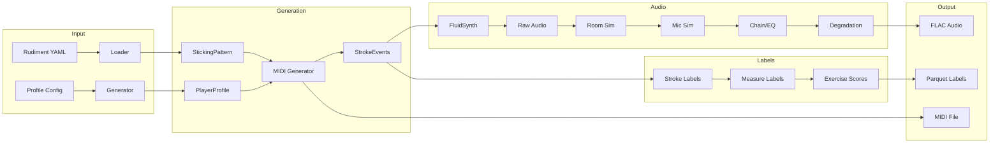

## Detailed Pipeline Stages

### Stage 1: Rudiment Loading

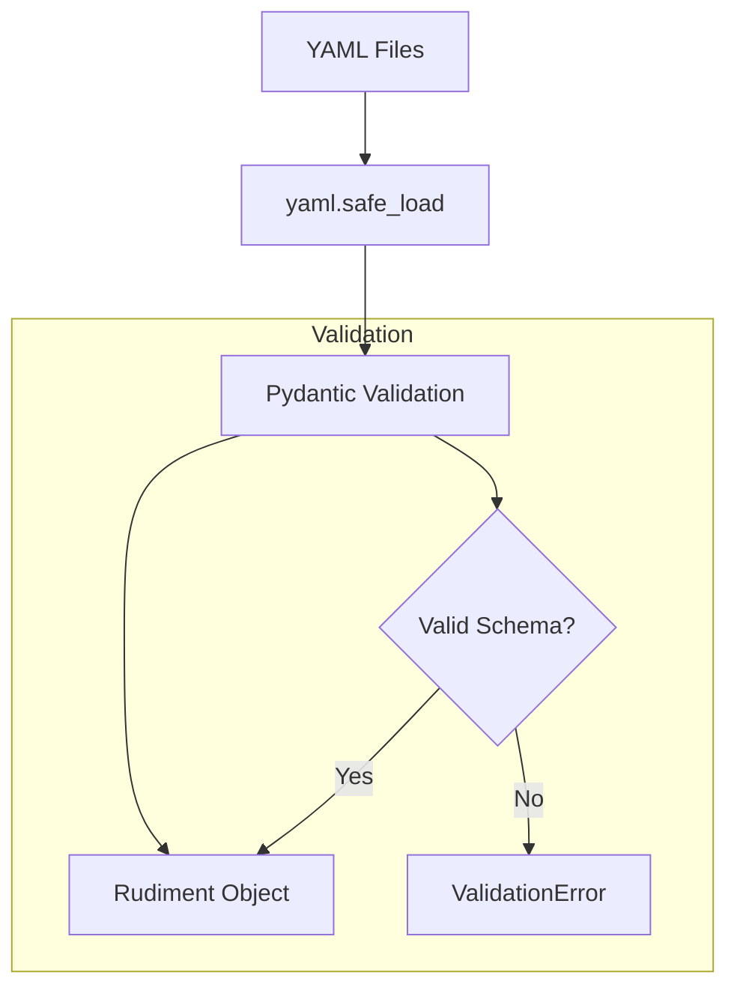

**Module**: `dataset_gen/rudiments/loader.py`

The loader reads YAML definitions from `dataset_gen/rudiments/definitions/` and validates them against Pydantic schemas. Each rudiment file specifies:

- Pattern structure (strokes with hand, type, timing)
- Subdivision and tempo range
- Category-specific parameters

### Stage 2: Profile Generation

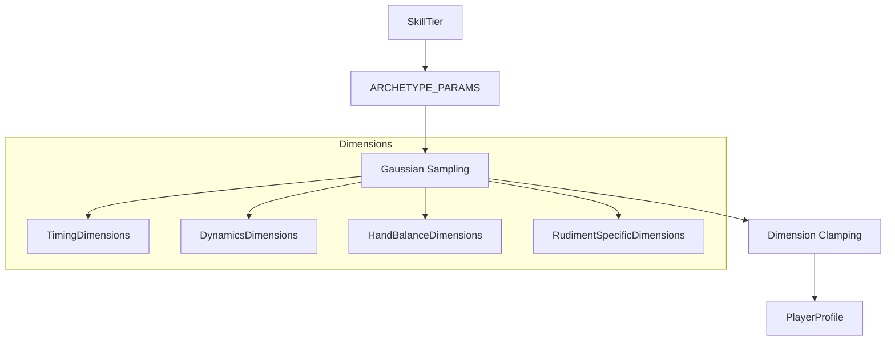

**Module**: `dataset_gen/profiles/archetypes.py`

Profiles are generated from archetype parameters with Gaussian sampling. Each skill tier (beginner, intermediate, advanced, professional) has distinct parameter ranges derived from percussion research literature.

### Stage 3: MIDI Generation

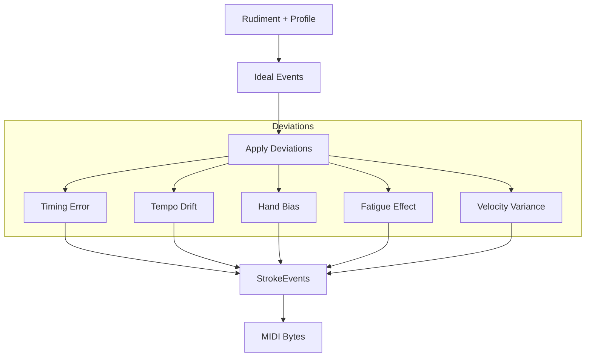

**Module**: `dataset_gen/midi_gen/generator.py`

The MIDI generator:

1. Creates ideal stroke events from the rudiment pattern
2. Applies player-specific deviations based on profile dimensions
3. Encodes events as Standard MIDI Format bytes

### Stage 4: Audio Synthesis

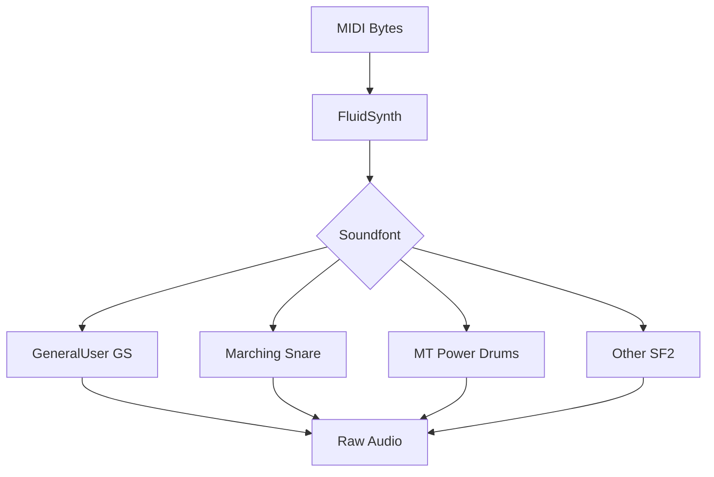

**Module**: `dataset_gen/audio_synth/synthesizer.py`

FluidSynth renders MIDI to audio using SF2 soundfonts. Multiple soundfonts provide timbral variety across practice pad, marching snare, and drum kit sounds.

### Stage 5: Audio Augmentation

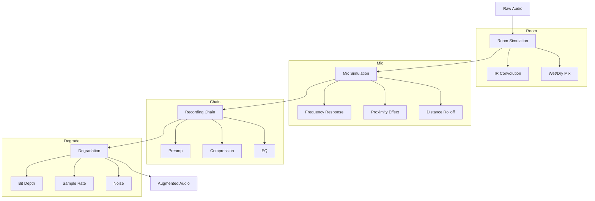

**Module**: `dataset_gen/audio_aug/pipeline.py`

The augmentation pipeline applies realistic recording conditions through four stages, each with configurable parameters.

### Stage 6: Label Computation

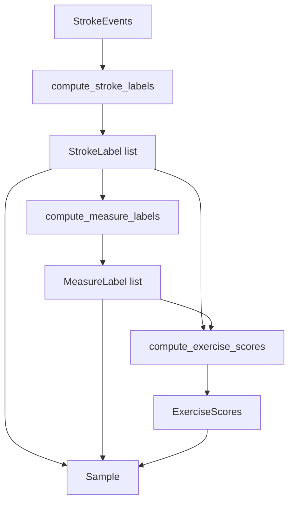

**Module**: `dataset_gen/labels/compute.py`

Labels are computed hierarchically:

1. **Stroke level**: Individual timing/velocity errors
2. **Measure level**: Aggregate statistics per measure
3. **Exercise level**: Composite performance scores

### Stage 7: Storage

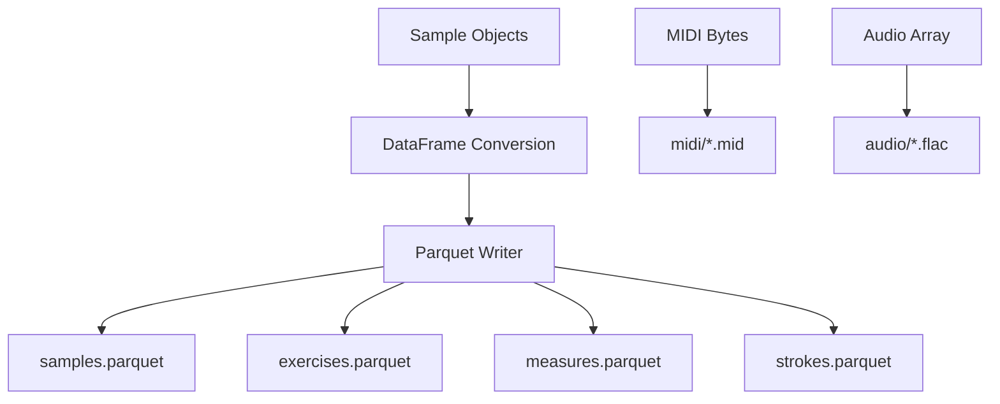

**Module**: `dataset_gen/pipeline/storage.py`

Final outputs are written to:

- Parquet files for structured labels
- MIDI files for symbolic data
- FLAC files for lossless audio

---

## Data Structure Relationships

### Class Diagram

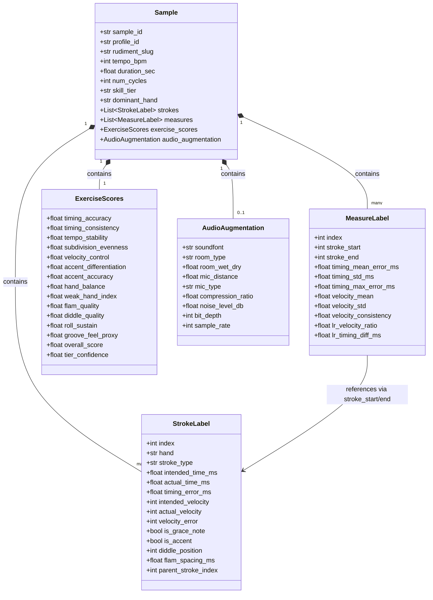

### Rudiment Structure

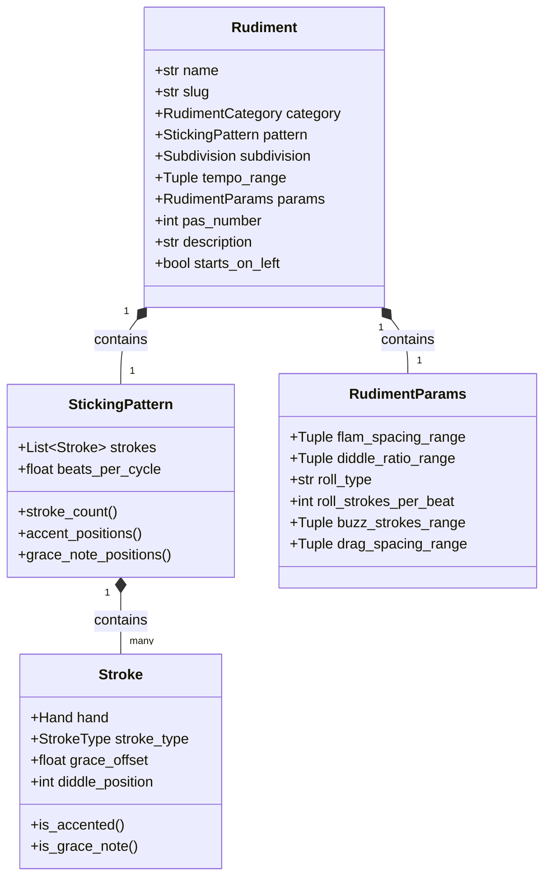

### Player Profile Structure

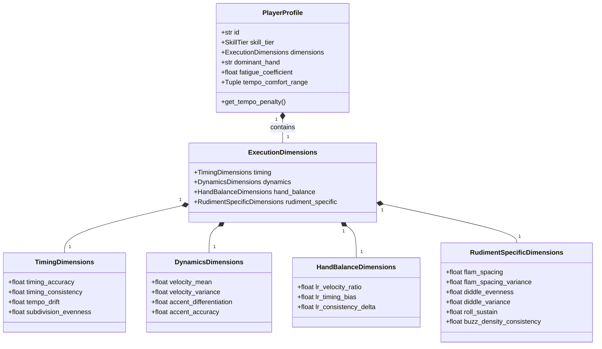

---

## Module Organization

```
dataset_gen/
├── rudiments/
│   ├── definitions/     # 40 YAML files
│   ├── schema.py        # Pydantic models
│   └── loader.py        # YAML loading
│
├── profiles/
│   ├── archetypes.py    # Profile generation
│   └── sampler.py       # Batch sampling
│
├── midi_gen/
│   ├── generator.py     # MIDI generation
│   └── articulations.py # Articulation handling
│
├── audio_synth/
│   └── synthesizer.py   # FluidSynth wrapper
│
├── audio_aug/
│   ├── room.py          # Room simulation
│   ├── mic.py           # Mic simulation
│   ├── chain.py         # Recording chain
│   ├── degradation.py   # Quality degradation
│   └── pipeline.py      # Augmentation orchestration
│
├── labels/
│   ├── schema.py        # Label Pydantic models
│   ├── compute.py       # Score computation
│   └── groove.py        # Groove metrics
│
├── pipeline/
│   ├── generate.py      # Main orchestration
│   ├── parallel.py      # Multiprocessing
│   ├── checkpoint.py    # Resumable generation
│   ├── storage.py       # Parquet writing
│   └── splits.py        # Train/val/test splits
│
├── validation/
│   ├── verify.py        # Data integrity checks
│   ├── realism.py       # Literature validation
│   └── report.py        # Report generation
│
└── hub/
    └── uploader.py      # HuggingFace upload
```

---

## Parallel Processing

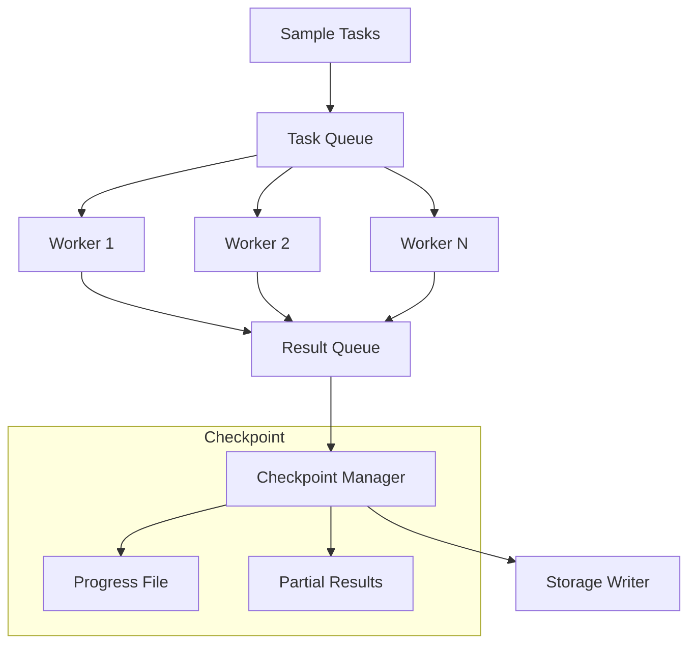

**Module**: `dataset_gen/pipeline/parallel.py`

The pipeline supports:

- **Multiprocessing**: CPU-parallel sample generation
- **Checkpointing**: Resume interrupted generation
- **Batch writing**: Efficient Parquet append operations

---

## Data Flow Summary

| Stage | Input | Output | Key Module |
|-------|-------|--------|------------|
| Load | YAML files | `Rudiment` objects | `rudiments/loader.py` |
| Profile | Skill tier | `PlayerProfile` objects | `profiles/archetypes.py` |
| MIDI | Rudiment + Profile | `StrokeEvent` list + MIDI bytes | `midi_gen/generator.py` |
| Synth | MIDI bytes | Raw audio array | `audio_synth/synthesizer.py` |
| Augment | Raw audio | Augmented audio | `audio_aug/pipeline.py` |
| Label | StrokeEvents | `Sample` with all labels | `labels/compute.py` |
| Store | Samples | Parquet + MIDI + FLAC files | `pipeline/storage.py` |

## See Also

- [Rudiment Schema](rudiment-schema.md) - YAML format specification
- [Score Computation](score-computation.md) - Scoring algorithms
- [Audio Processing](audio-processing.md) - Augmentation details
