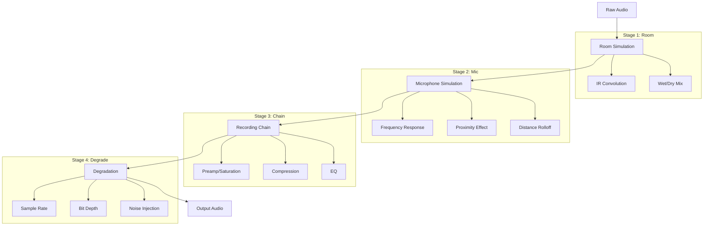

# Audio Processing

This document describes SOUSA's audio augmentation pipeline, which simulates realistic recording conditions to create diverse training data.

## Pipeline Overview

The audio augmentation pipeline processes raw synthesized audio through four stages:



---

## Stage 1: Room Simulation

**Module**: `dataset_gen/audio_aug/room.py`

Room simulation adds acoustic space characteristics using convolution reverb.

### Room Types

| Room Type | RT60 (sec) | Early Reflections (ms) | Default Wet/Dry |
|-----------|------------|------------------------|-----------------|
| `PRACTICE_ROOM` | 0.3 | 8 | 0.15 |
| `STUDIO` | 0.5 | 15 | 0.25 |
| `BEDROOM` | 0.25 | 5 | 0.10 |
| `GARAGE` | 0.8 | 25 | 0.30 |
| `GYM` | 1.5 | 50 | 0.35 |
| `CONCERT_HALL` | 2.0 | 40 | 0.40 |
| `CHURCH` | 3.0 | 60 | 0.50 |
| `OUTDOOR` | 0.1 | 100 | 0.05 |

### Configuration

```python
@dataclass
class RoomConfig:
    room_type: RoomType = RoomType.STUDIO
    wet_dry_mix: float = 0.3        # 0 = dry, 1 = wet only
    ir_path: Path | None = None     # Custom IR file
    decay_time_sec: float = 0.5     # RT60 approximation
    early_reflection_delay_ms: float = 20.0
    pre_delay_ms: float = 10.0
    ir_trim_sec: float | None = None
    ir_gain: float = 1.0
```

### Algorithm

**Impulse Response (IR) Convolution:**

When an IR file is available:

$$
y(t) = x(t) * h(t) = \int_{-\infty}^{\infty} x(\tau) \cdot h(t - \tau) \, d\tau
$$

Where:

- $x(t)$ is the input audio
- $h(t)$ is the impulse response
- $y(t)$ is the wet (reverberant) signal

**Synthetic IR Generation:**

When no IR is available, a synthetic reverb is generated:

1. Create exponential decay envelope:
   $$\text{envelope}(t) = e^{-6.91 \cdot t / \text{RT60}}$$

2. Add early reflections at calculated delays

3. Generate diffuse tail from filtered noise

4. Mix dry and wet signals:
   $$\text{output} = (1 - \text{wet\_dry}) \cdot \text{dry} + \text{wet\_dry} \cdot \text{wet}$$

---

## Stage 2: Microphone Simulation

**Module**: `dataset_gen/audio_aug/mic.py`

Microphone simulation applies frequency response curves and distance-based effects.

### Microphone Types

| Type | Character | Frequency Response |
|------|-----------|-------------------|
| `DYNAMIC` | SM57-style | Presence peak at 3-5kHz, rolled-off highs |
| `CONDENSER` | Flat, detailed | Slight air boost at 10kHz |
| `RIBBON` | Warm, vintage | Significant high rolloff above 8kHz |
| `PIEZO` | Contact mic | Harsh mids, limited range |

### Microphone Positions

| Position | Effect |
|----------|--------|
| `CENTER` | On-axis, no additional filtering |
| `OFF_AXIS` | Reduced highs (10kHz lowpass) |
| `OVERHEAD` | More room, less attack (5kHz lowpass) |
| `DISTANT` | Significant rolloff (3kHz lowpass) |

### Configuration

```python
@dataclass
class MicConfig:
    mic_type: MicType = MicType.CONDENSER
    position: MicPosition = MicPosition.CENTER
    distance_meters: float = 0.5
    proximity_effect: bool = True
    distance_rolloff: bool = True
    self_noise_db: float = -80.0
    output_gain: float = 1.0
```

### Frequency Response Curves

Each microphone type has a defined frequency response:

**Dynamic (SM57-style):**

| Frequency (Hz) | Gain (dB) |
|----------------|-----------|
| 20 | -6 |
| 80 | -3 |
| 200 | 0 |
| 1000 | 0 |
| 3000 | +3 |
| 5000 | +2 |
| 8000 | 0 |
| 12000 | -3 |
| 16000 | -8 |
| 20000 | -15 |

**Condenser:**

| Frequency (Hz) | Gain (dB) |
|----------------|-----------|
| 20 | -3 |
| 50 | 0 |
| 5000 | +1 |
| 10000 | +2 |
| 15000 | +1 |
| 20000 | -2 |

### Proximity Effect

Bass boost for close-miking (< 0.3m):

$$
\text{boost\_dB} = \max(0, (0.3 - \text{distance}) \times 20)
$$

Applied as a low shelf filter at 200Hz.

### Distance Rolloff

High frequency rolloff based on distance:

$$
f_{\text{rolloff}} = \frac{20000}{1 + \text{distance} \times 2}
$$

Clamped to 3000-15000 Hz range.

**Amplitude reduction** (inverse square law approximation):

$$
\text{amplitude} = \frac{1}{1 + \text{distance}^{1.5}}
$$

---

## Stage 3: Recording Chain

**Module**: `dataset_gen/audio_aug/chain.py`

The recording chain simulates analog processing: preamp, compression, and EQ.

### Preamp Types

| Type | Character | Saturation Style |
|------|-----------|------------------|
| `CLEAN` | Transparent | Minimal, soft clipping |
| `WARM` | Tube-style | Asymmetric, even harmonics, low-mid bump |
| `AGGRESSIVE` | Solid-state | Hard clipping, odd harmonics |
| `VINTAGE` | Transformer | Soft limiting, frequency coloration |

### Preamp Configuration

```python
@dataclass
class PreampConfig:
    preamp_type: PreampType = PreampType.CLEAN
    gain_db: float = 0.0      # Input gain
    drive: float = 0.0        # Saturation amount (0-1)
    output_gain_db: float = 0.0
```

### Saturation Algorithms

**Soft Clipping (tanh):**

$$
y = \tanh(x \cdot (1 + \text{drive} \times 3))
$$

**Hard Clipping:**

$$
y = \text{clip}(x \cdot (1 + \text{drive} \times 2), -\text{threshold}, \text{threshold})
$$

Where $\text{threshold} = 1.0 - \text{drive} \times 0.7$

**Tube Saturation (asymmetric):**

```python
positive = np.tanh(positive_signal)
negative = np.tanh(negative_signal * 0.9) * 1.1  # Asymmetry
```

### Compressor Configuration

```python
@dataclass
class CompressorConfig:
    enabled: bool = True
    threshold_db: float = -12.0
    ratio: float = 4.0           # e.g., 4:1
    attack_ms: float = 10.0
    release_ms: float = 100.0
    knee_db: float = 6.0         # Soft knee width
    makeup_gain_db: float = 0.0
```

### Compression Algorithm

**Gain Reduction:**

For input level $L$ above threshold $T$:

$$
G = \left(\frac{T}{L}\right)^{1 - 1/R}
$$

Where $R$ is the compression ratio.

**Soft Knee:**

In the knee region ($T - \frac{K}{2}$ to $T + \frac{K}{2}$):

$$
R_{\text{effective}} = 1 + \frac{L - T_{\text{start}}}{T_{\text{end}} - T_{\text{start}}} \times (R - 1)
$$

**Time Constants:**

$$
\alpha_{\text{attack}} = e^{-1 / (f_s \times t_{\text{attack}})}
$$

$$
\alpha_{\text{release}} = e^{-1 / (f_s \times t_{\text{release}})}
$$

### EQ Configuration

```python
@dataclass
class EQConfig:
    enabled: bool = True
    highpass_freq: float = 40.0      # Hz
    highpass_enabled: bool = True
    lowpass_freq: float = 18000.0    # Hz
    lowpass_enabled: bool = True
    low_shelf: tuple[float, float] = (100.0, 0.0)   # (freq, gain_db)
    high_shelf: tuple[float, float] = (8000.0, 0.0)
```

### EQ Implementation

- **Highpass/Lowpass**: 2nd-order Butterworth filters
- **Shelving**: 1st-order filters with gain mixing

---

## Stage 4: Degradation

**Module**: `dataset_gen/audio_aug/degradation.py`

Degradation simulates imperfect recording conditions.

### Noise Types

| Type | Character | Implementation |
|------|-----------|----------------|
| `WHITE` | Flat spectrum | Gaussian noise |
| `PINK` | 1/f spectrum | Voss-McCartney algorithm |
| `BROWN` | 1/f^2 (rumble) | Integrated white noise |
| `HVAC` | Air conditioning | 60Hz hum + filtered broadband |
| `ROOM_TONE` | Ambient | Bandpass filtered pink noise |
| `TAPE_HISS` | High frequency | Highpass filtered white noise |
| `VINYL` | Crackle/pops | Brown noise + random impulses |

### Noise Configuration

```python
@dataclass
class NoiseConfig:
    enabled: bool = True
    noise_type: NoiseType = NoiseType.PINK
    level_db: float = -40.0    # Relative to signal
    noise_file: Path | None = None
```

### Noise Level Calculation

$$
\text{noise\_amplitude} = \text{signal\_rms} \times 10^{\text{level\_dB} / 20}
$$

### Bit Depth Reduction

```python
@dataclass
class BitDepthConfig:
    enabled: bool = False
    bit_depth: int = 16       # 24, 16, 12, or 8
    dither: bool = True       # TPDF dither
```

**Quantization:**

$$
y = \frac{\text{round}(x \times 2^{n-1})}{2^{n-1}}
$$

Where $n$ is the target bit depth.

**TPDF Dither:**

Triangular probability density function dither is added before quantization to reduce harmonic distortion:

$$
\text{dither} = \frac{r_1 + r_2 - 1}{2^{n-1}}
$$

Where $r_1, r_2$ are uniform random values in [0, 1].

### Sample Rate Degradation

```python
@dataclass
class SampleRateConfig:
    enabled: bool = False
    target_rate: int = 22050
    anti_alias: bool = True
```

**Process:**

1. Apply anti-aliasing lowpass filter at $f_{\text{target}} / 2$
2. Downsample to target rate
3. Upsample back to original rate

This introduces aliasing artifacts characteristic of low-quality recordings.

### Additional Degradations

| Parameter | Range | Effect |
|-----------|-------|--------|
| `dc_offset` | -1 to 1 | Adds DC offset |
| `phase_shift` | 0 to 1 | Phase difference between stereo channels |
| `wow_flutter` | 0 to 1 | Tape-style pitch variation |
| `dropout_probability` | 0 to 1 | Brief audio dropouts |

**Wow and Flutter:**

$$
\text{modulation}(t) = 1 + \sin(2\pi f_{\text{wow}} t) \cdot a_{\text{wow}} + \sin(2\pi f_{\text{flutter}} t) \cdot a_{\text{flutter}}
$$

Where:

- $f_{\text{wow}} \in [0.5, 2]$ Hz
- $f_{\text{flutter}} \in [5, 15]$ Hz
- Amplitudes scale with the `wow_flutter` parameter

---

## Augmentation Presets

SOUSA includes predefined augmentation presets for common scenarios:

| Preset | Room | Mic | Compression | Noise | Use Case |
|--------|------|-----|-------------|-------|----------|
| `cleanstudio` | None | Close | None | None | Reference recordings |
| `cleanclosed` | Small | Close | Light | None | Studio practice |
| `practiceroom` | Practice | Medium | Light | Low | Typical practice |
| `concerthall` | Hall | Far | None | Low | Live performance |
| `gym` | Gymnasium | Far | None | Medium | Marching band |
| `garage` | Garage | Medium | Medium | Medium | Band rehearsal |
| `vintagetape` | Medium | Medium | Tape saturation | Tape hiss | Vintage aesthetic |
| `lofi` | Variable | Variable | Heavy | High | Lo-fi aesthetic |
| `phonerecording` | None | Poor | Heavy limiting | High | Phone recordings |

### Preset Configuration Example

```python
# 'practiceroom' preset
config = AugmentationConfig(
    room=RoomConfig(
        room_type=RoomType.PRACTICE_ROOM,
        wet_dry_mix=0.15,
    ),
    mic=MicConfig(
        mic_type=MicType.DYNAMIC,
        distance_meters=0.8,
    ),
    chain=ChainConfig(
        compressor=CompressorConfig(
            threshold_db=-18.0,
            ratio=2.0,
        ),
    ),
    degradation=DegradationConfig(
        noise=NoiseConfig(
            noise_type=NoiseType.ROOM_TONE,
            level_db=-45.0,
        ),
    ),
)
```

---

## Output Specifications

| Property | Value |
|----------|-------|
| Format | FLAC (lossless) |
| Sample Rate | 44,100 Hz |
| Bit Depth | 24-bit |
| Channels | Mono |
| Duration | 4-12 seconds typical |

---

## Implementation Notes

### Processing Order

The fixed processing order ensures consistent results:

1. Room simulation (affects spatial characteristics)
2. Mic simulation (captures source character)
3. Recording chain (analog processing)
4. Degradation (final quality reduction)

### Performance Considerations

- **IR Caching**: Impulse responses are cached to avoid repeated disk reads
- **Noise Caching**: External noise files are cached and looped as needed
- **Filter Design**: Filters are designed once per configuration

### Clipping Prevention

Each stage includes output limiting:

```python
max_val = np.max(np.abs(output))
if max_val > 1.0:
    output = output / max_val * 0.99
```

---

## Usage Example

```python
from dataset_gen.audio_aug.pipeline import AugmentationPipeline

# Create pipeline with preset
pipeline = AugmentationPipeline.from_preset("practiceroom")

# Process audio
augmented = pipeline.process(raw_audio, sample_rate=44100)

# Or with custom config
from dataset_gen.audio_aug.room import RoomConfig, RoomType
from dataset_gen.audio_aug.chain import ChainConfig, PreampType

config = AugmentationConfig(
    room=RoomConfig(room_type=RoomType.GARAGE),
    chain=ChainConfig(
        preamp=PreampConfig(preamp_type=PreampType.WARM, drive=0.3)
    ),
)
augmented = pipeline.process(raw_audio, config=config)
```

## See Also

- [Architecture](architecture.md) - Pipeline overview
- [Data Format](data-format.md) - Augmentation metadata in Parquet
